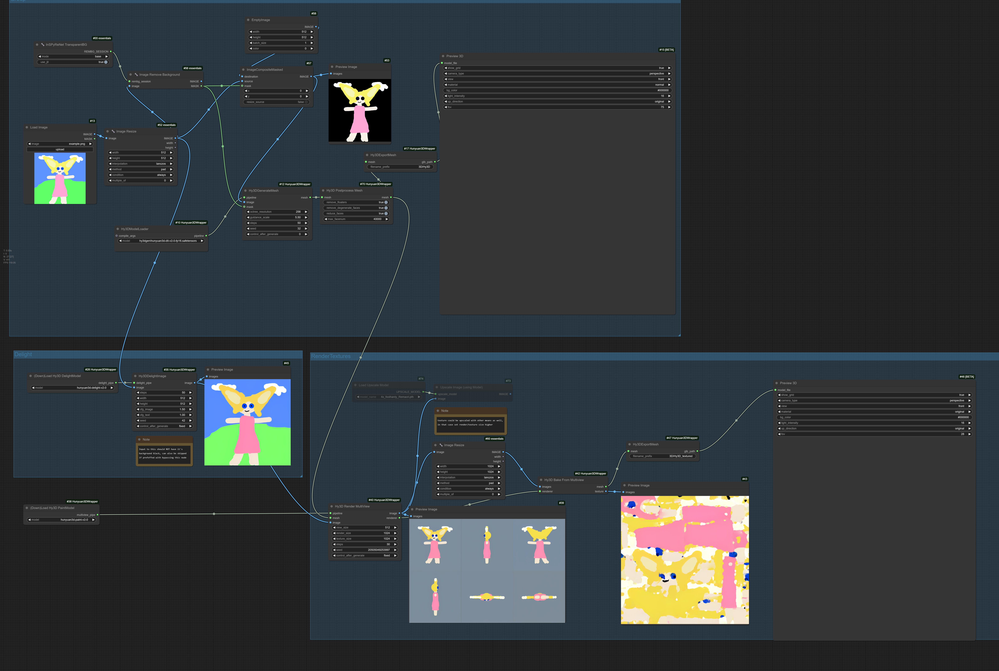

# ComfyUI wrapper for [Hunyuan3D-2](https://github.com/Tencent/Hunyuan3D-2)

# WORK IN PROGRESS
# installation still messy, may require compiling for texture gen

Main model, original: https://huggingface.co/tencent/Hunyuan3D-2/blob/main/hunyuan3d-dit-v2-0/model.ckpt

Converted to .safetensors: https://huggingface.co/Kijai/Hunyuan3D-2_safetensors

to `ComfyUI/models/diffusion_models/`

Rest of the models are diffusers models, so they are wrapped and autodownloaded for now. Very new version of ComyUI is also required for the Preview3D -node.

# Installation
Dependencies, in your python env:

`pip install -r requirements.txt`

or with portable:

`python_embeded\python.exe -m pip install -r ComfyUI\custom_nodes\ComfyUI-Hunyuan3DWrapper\requirements.txt`


For the texturegen part compilation is needed, I have included my compilations as a wheel for the rasterizer, and compiled .pyd for the mesh_processor (already in place), these are compiled for:

- Windows 11 python 3.12 cu126 (works with torch build on 124)

You would do `pip install wheels\custom_rasterizer-0.1-cp312-cp312-win_amd64.whl`

or with portable (in `ComfyUI_windows_portable` -folder):
`python_embeded\python.exe -m pip install ComfyUI\custom_nodes\ComfyUI-Hunyuan3DWrapper\wheels\custom_rasterizer-0.1-cp312-cp312-win_amd64.whl` 

This was tested to work on latest ComfyUI portable install

If this doesn't work, you need to compile yourself:

Rasterizer, to build and install:

```
cd hy3dgen/texgen/custom_rasterizer
python setup.py install
```

Or build with `python setup.py bdist_wheel` which creates the .whl file to the dist -subfolder, which you then would pip install to your python environment. 
End result needs to be `custom_rasterizer_kernel*.pyd` file and `custom_rasterizer` folder in your python environments `site-packages` folder.

For the mesh_processor extension the build command would be this:
```
cd hy3dgen/texgen/differentiable_renderer
python setup.py build_ext --inplace
```
This file is supposed to be in that very folder. It is only used for the vertex inpainting, if this file doesn't exist the fallback is ran on cpu and is much slower. The vertex inpainting is on it's own node and in the worst case can just be bypassed, downside would be worse filling of the textures.

Again, with portable you should use the embedded python to run the commands.


